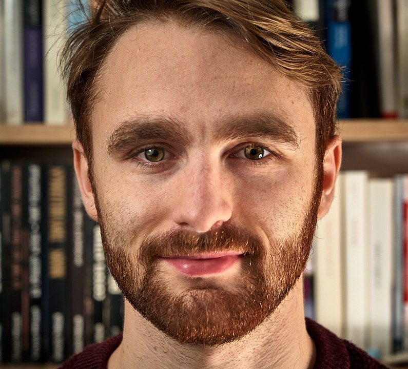
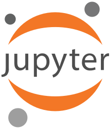
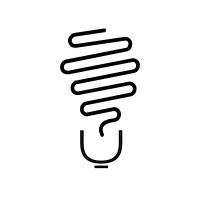
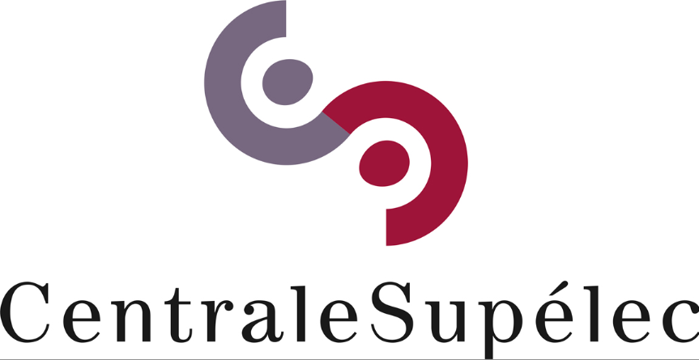

  
  
  

{: style="text-align: center"}
## Short Bio 
{: style="text-align: center"}
<!--

  

  

  

  

--> 
<!--I come from Paris where I learned engineering and I built an academic background in mathematics and computer science. Previously, I worked as a **Research Engineer** at [**I²R -- A*Star**](https://www.a-star.edu.sg/) in the **Deep Learning** 2.0 team. My research focused on incorporating Common Sense knowledge from knowledge graph into Natural Language Processing systems. I graduated in 2018 from the **Master of Engineering** in EECS of [**UC Berkeley**](https://funginstitute.berkeley.edu/programs-centers/full-time-program/), specializing in Data Science and Systems with added emphasis on Engineering Leadership and strong insights in Entrepreneurship. --> 
[Last updated on September 2nd 2022]

I am a **Ph.D. candidate** in the [Department of Computer Science, Data and Artificial Intelligence](https://www.ip-paris.fr/en/research/education-and-research-departments/department-computer-science-data-and-artificial-intelligence) at [Institut Polytechnique de Paris](https://www.ip-paris.fr/) (IP Paris), funded by a Google doctoral fellowship and working on Neural Natural Language Processing. I am supervised by [Prof. Thomas Bonald](https://perso.telecom-paristech.fr/bonald/Home_page.html) ([IMT](https://www.imt.fr/en/) [LTCI](https://www.telecom-paris.fr/en/research/laboratories/information-processing-and-communication-laboratory-ltci)) and [Dr. Lucas Dixon](https://jigsaw.google.com/) ([Google Brain](https://ai.google/)). I am also a member of the [Laboratory of Information, Networking and Communication Sciences](https://www.lincs.fr/) (LINCS).  
{: style="text-align: justify"}
I am broadly interested in Machine Learning and Artificial Neural Networks for Natural Language Understanding and Generation. My thesis focus is on the **analysis and control of online interactions through Neural Natural Language Processing**.
{: style="text-align: justify"}
Prior to joining IP Paris, I spent a fantastic year as a pre-doctoral research engineer at the [Institute for Infocomm Research](https://www.a-star.edu.sg/i2r) (I²R) of the [Agency for Science, Technology and Research](https://www.a-star.edu.sg/) (A*STAR). There, I was a member of the [Deep Learning 2.0](https://www.a-star.edu.sg/i2r/RESEARCH/DEEP-LEARNING) team and worked with [Dr. Anran Wang](https://sites.google.com/site/1991wanganran/), [Dr. Chuan–Sheng Foo](http://ai.stanford.edu/~csfoo/) and [Dr. Vijay Chandrasekhar](http://vijaychan.github.io/). I completed my **Master in computer science** in May 2018 at the [University of California, Berkeley](https://funginstitute.berkeley.edu/programs-centers/full-time-program/) where I was advised by [Prof. Laurent El Ghaoui](https://people.eecs.berkeley.edu/~elghaoui/). 
{: style="text-align: justify"}
You can find out more about my research and outreach activities by exploring the rest of my site and [my GitHub repositories](https://github.com/LeoLaugier). 
{: style="text-align: justify"}

## Experience and Education
{: style="text-align: center"}
<!--
## Experience

  

* June 2018 - February 2019: [_Research Engineer_](https://www.a-star.edu.sg/i2r/RESEARCH/DEEP-LEARNING) -- **Agency for Science, Technology and Research (A\*STAR) Institute for Infocomm Research (I²R)**, Singapore      
  * Incorporated **Common Sense knowledge** from MIT **ConceptNet** knowledge base into **NLP** systems with **PyTorch**.
  * Built relevant **Common Sense graphs** to improve **Sentiment Analysis** and **Question Answering** systems. 
  * Tuned **hyperparameters** to find the best architecture for **Graph Convolutional Neural Networks** (GCNN). 
  * **Published** as first author in the Machine Learning for Molecules and Materials **NeurIPS 2018 Workshop** _Predicting thermoelectric properties from crystal graphs and material descriptors - first application for functional materials._

  

  
* December 2015 - December 2016: [_General Secretary_](https://www.facebook.com/centralesupelecgenius/) -- **Genius CentraleSupélec**, Gif-sur-Yvette, France
  * Genius is a federation that includes 8 student associations from French institutions of higher education. Its objective is to federate student entrepreneurs to favor innovation and to spur new business start-up.
  * Coordinated and hosted 2 pitch contests and 5 meetings between 200 students and 30 startups.
  * Facilitated weekly club meetings for 29 members.
  * Won the 2015 Startup Night over 7 competing teams.

  

  
* July 2016: [_Practical Trainee_](https://www.ibm.com/ibm/clientcenter/montpellier/index.shtml) -- **IBM**, Montpellier, France
  * Supported a team of experts and architects to the implementation of technical platforms in a data center.

  

  
* July 2014 - August 2014: [_Undergraduate summer intern_](https://public.lanl.gov/geophysics/geophysics/index.shtml) -- **Los Alamos National Laboratory**, Los Alamos, New Mexico 
	* <u>Division</u>: Earth and Environmental Science  
  * Computed regularized least squares methods on data from the **Dynamic AcoustoElasticity Testing** to find parameters of the behavior of non-linear materials.

## Education

  

* August 2017 - May 2018: [_Master of Engineering_](https://eecs.berkeley.edu/academics/graduate/industry-programs/meng) -- **University of California**, Berkeley, California
    * <u>Department</u>: **Electrical Engineering and Computer Sciences** 
    * <u>Concentration</u>: **Data Science & Systems**
    * <u>Relevant coursework</u>: Machine Learning  , Database Systems  , Deep Learning  , Parallel Computing    
    * <u>GPA</u>: 3.86/4.0 

  

* September 2015 - July 2017: [_Bachelor of Science_](https://www.centralesupelec.fr/en/our-studies) -- **University of Paris-Saclay**, Gif-sur-Yvette, France
    * <u>School</u>: **CentraleSupéléc**
    * <u>Major</u>: Electrical Engineering and Computer Sciences 
    * <u>Relevant coursework</u>: Software Engineering    , Information Theory, Probability Theory, Statistics, Optimization, Big Data.
    * <u>GPA</u>: 3.95/4 ; <u>Ranking</u>: 21st / 462

  

* September 2013 - July 2015: [_Preparatory years for high scientific schools_](/doc/curriculumcpge.pdf) -- **Lycée Condorcet**, Paris, France
    * <u>Major</u>: **Mathematics, Physics and Computer Sciences** 
    * <u>Relevant coursework</u>: Programming Methods  , Data Structures and Algorithms   , Logic, Finite Automata, Algebra, General Topology, Euclidean and Hermitian spaces, Function of several real variables and differential calculus.
-->    