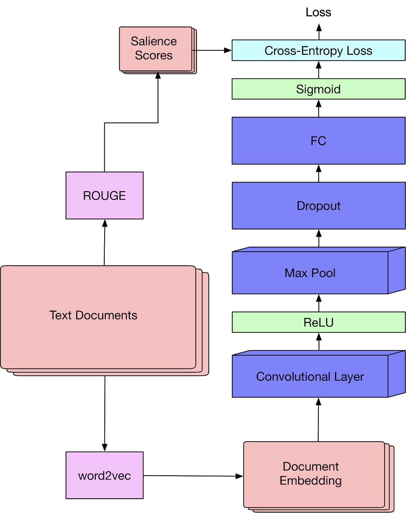
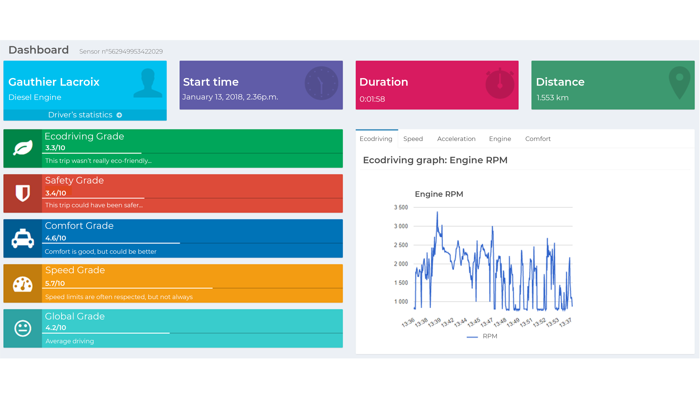

## Master of Engineering Capstone Project on Representation Learning for text   
**UC Berkeley** -- George Fei, Leo Laugier, Scott Johnson and Shikun Ding 
<!--<a<iframe width="820" height="461" src="https://www.youtube.com/embed/CtaEdjT_vAs" frameborder="0" allow="accelerometer; autoplay; encrypted-media; gyroscope; picture-in-picture" allowfullscreen></iframe>
Nowadays, social networks are mines of information for revealing people’s opinions, from their political views to their thoughts regarding a company or a product. In addition, online journalism produces data in natural English describing and analyzing the market. Therefore, we decided to design and build **deep learning and classic machine learning models for predictive tasks useful for financial analysts**. Particularly, this capstone project focuses on **mining opinion from news headlines to predict stock market trends** by using various techniques, including **representation learning**, **sentiment analysis**, and **keyword extraction**. Whereas current methods often rely on human-engineered features, we successfully built a **Convolutional Neural Network** (CNN) combined with a **Support Vector Machine** (SVM) to extract meaningful positive/negative keywords and perform accurate predictions of the stock price trends, for specific markets.-->

<table cellspacing="0" cellpadding="0" style="table-layout: fixed; text-align: left; font-size: 100%;">
  <tbody>
    <tr>
      <td  align="center" style="width: 40%; border: none;"><iframe  width="560" height="315" src="https://www.youtube.com/embed/CtaEdjT_vAs" frameborder="0" allow="accelerometer; autoplay; encrypted-media; gyroscope; picture-in-picture" allowfullscreen></iframe></td>
    </tr>
    <tr>
      <td  align="justify" style="width: 60%;  border: none;">Nowadays, social networks are mines of information for revealing people’s opinions, from their political views to their thoughts regarding a company or a product. In addition, online journalism produces data in natural English describing and analyzing the market. Therefore, we decided to design and build **deep learning and classic machine learning models for predictive tasks useful for financial analysts**. Particularly, this capstone project focuses on **mining opinion from news headlines to predict stock market trends** by using various techniques, including **representation learning**, **sentiment analysis**, and **keyword extraction**. Whereas current methods often rely on human-engineered features, we successfully built a **Convolutional Neural Network** (CNN) combined with a **Support Vector Machine** (SVM) to extract meaningful positive/negative keywords and perform accurate predictions of the stock price trends, for specific markets.</td>
    </tr>
  </tbody>
</table>

## Extractive Document Summarization Based on Convolutional Neural Networks   
**UC Berkeley** -- Leo Laugier, Evan Thompson and Alexandros Vlissidis

<table cellspacing="0" cellpadding="0" style="table-layout: fixed; text-align: left; font-size: 100%;">
  <tbody>
    <tr>
      <td style="width: 40%; border: none;"></td>
      <td  align="justify" style="width: 60%;  border: none;">Extractive Summarization is a method, which aims to automatically generate summaries of documents through the extraction of sentences in the text. This task is challenging because compared to key-phrase extraction, text summarization needs to generate a whole sentence that described the given document, instead of just single phrases. Another challenge for this task has been the manual generation of text summaries for supervised learning. Legacy algorithms use predefined handcrafted features of the text for representation. This makes it extremely painful to build an effective algorithm. We implemented an algorithm described by Y. Zhang et al.[1], where a Convolutional Neural Network (CNN) approach is proposed for this task. This has the benefit that it can use word-embedding to represent text and the neural network can extract features automatically.</td>
    </tr>
  </tbody>
</table>

## Integrated Model and Data Parallelism for Training Deep Neural Networks  
**UC Berkeley** -- Leo Laugier, Lysia Li, Daniel Avery Nisbet and Evan Thompson

<table cellspacing="0" cellpadding="0" style="table-layout: fixed; text-align: left; font-size: 100%;">
  <tbody>
    <tr>
      <td align="center"  style="width: 40%; border: none;"></td>
    </tr>
    <tr>
      <td  align="justify" style="width: 60%;  border: none;">Neural Networks, used in a myriad of problems from financial modeling to computer vision, are widely considered one of the most powerful machine learning models known. These complicated collections of ”neurons” can approximate any function but require significant amounts of time to train. However, this training time can be greatly reduced through the use of parallel computing. Two common types of parallelism within Neural Networks are batch parallelism and model parallelism. These paradigms allow for large datasets and models to be efficiently computed in a high performance computing environment. We investigate the performance of both batch and model parallelism as well as a combined method. Using pure batch parallelism, we achieved 5.8x speedup by running 32 processes with batch size = 100 and model size = 1,024. Using pure model parallelism, we achieved 1.2x speedup with model size = 1,024. Integrating batch and model parallelism, the performance was 0.99x compared to the pure batch approach under the experiments setup.</td>
    </tr>
  </tbody>
</table>

## Undergraduate Capstone Project EasyDrive    
**CentraleSupélec** -- Léon Cardineaud, Arnaud d'Esquerre, Leo Laugier, Olivier Rouanet

<table cellspacing="0" cellpadding="0" style="table-layout: fixed; text-align: left; font-size: 100%;">
  <tbody>
    <tr>
      <td align="center"  style="width: 40%; border: none;"></td>
    </tr>
    <tr>
      <td  align="justify" style="width: 60%;  border: none;">EasyDrive is both an entrepreneurial and academic project of remote driving analysis through the Internet of Things. We have conceived a tool for decision support towards car fleet managers and private clients. We have targeted companies of private cars, carpooling, car sharing, delivering, renting, conveyors, and insurers to respond to their need in automatic rating of driving parameters (safety, comfort and energy-efficient driving). After one school year, our team have achieved its original goals by producing a Plug & Play device (called EasySensor) connected to an up and running application to analyze driving (called EasyApp). EasySensor was financed by Objenious (Bouygues Telecom subsidiary) and CentraleSupélec. It is made of an Arduino board to collect driving data from an accelerometer, a GPS and a Bluetooth OBD connector. It sends the preprocessed data on the LoRaWan network towards Objenious servers. EasyApp gathers the preprocessed data from Objenious servers to analyse it on our servers and rate rides. We display the results on the Django website with the Google Maps API, the Google Chart API and the AdminLTE Control Model Template.</td>
    </tr>
  </tbody>
</table>